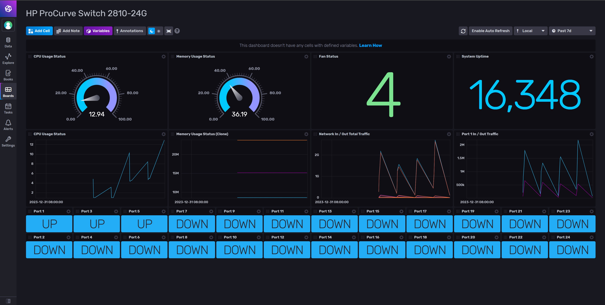

# grafana-influxDB-telegraf-monitoring

Using Grafana, Telegraf, and InfluxDB for monitoring HP ProCurve 2810-24G Switch via SNMP Protocol.

## Setup

1. Enable HP Procurve switch SNMP server.

    ```sh
    configure terminal
    snmp-server enable
    show snmp-server
    write memory
    ```

2. Make sure the HP Procurve switch has been enabled on the SNMP server.

    ```sh
    ./SnmpWalk.exe -v:2 -c:public -r:192.168.2.254
    ```

3. Setup the Telegraf SNMP Agent config, see the `examples/telegraf-procurve-switch.conf` replace the IP address.

4. Setup the InfluxDB config `.env` file.

5. Start the services

    ```sh
    docker-compose up -d
    ```

6. Login the InfluxDB dashboard `http://<IP_ADDRESS>:8086`

7. Import the dashboard from the `examples/hp_procurve_switch_2810-24g.json`
